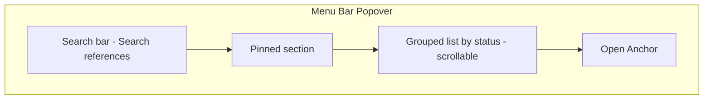

# Menu Bar Layout

This document describes the **on-click menu bar popover** only — the dropdown that appears when the user clicks the Anchor icon. It does not cover the Anchor dashboard window.

---

## Design Principles

- **Minimal** — No sidebar, no tabs; one panel, one list.
- **Keyboard-first** — Focus goes to search on open; arrow keys and Enter drive the list.
- **Fast** — Search filters as you type; list is simple with no heavy per-row UI.
- **No clutter** — Status and tags shown as compact pills or badges where needed.

The popover is for **browse, search, and launch** only. All add/edit of references and metadata happens in the Anchor dashboard (opened via "Open Anchor" at the bottom). See [project.md](../project.md) for the full product vision.

---

## Layout (Top to Bottom)

1. **Search bar** — Single line at the very top. Placeholder: **"Search references…"**. Sticky; focus here when the popover opens so the user can type immediately.

2. **Pinned** — Section label "Pinned" and a short list of pinned references (reference name; optional one tag or type). Fixed height or max ~3–5 items visible with scroll if needed.

3. **Divider** — Visual separator.

4. **Grouped list** — References grouped by **status** (e.g. Active, Paused, Idea, Completed, Archived). Optionally group by type (Folder / File / Note / Task list) or show type as secondary info. **Only this list area scrolls**; search and footer stay fixed. Each row: primary = reference name; secondary = truncated path or type/tags. Quick actions (Open in Finder, Terminal, VSCode, Reveal) on hover or selection.

5. **Divider** — Visual separator.

6. **Footer** — Single row: **"Open Anchor"**. Clicking opens the Anchor dashboard (reference list, add/edit metadata, settings).

---

## ASCII Wireframe

```
┌─────────────────────────────────────────┐
│  🔍  Search references...               │
├─────────────────────────────────────────┤
│  Pinned                                 │
│  • NEPSE Watchlist MVP                  │
│  • Flutter game                         │
├─────────────────────────────────────────┤
│  Active                                 │
│  • portfolio-site                      │
│  • anchor (this project)                │
├─────────────────────────────────────────┤
│  Paused                                 │
│  • nepse-watchlist                      │
├─────────────────────────────────────────┤
│  Idea                                   │
│  • notes-app                            │
├─────────────────────────────────────────┤
│           Open Anchor                   │
└─────────────────────────────────────────┘
```



---

## Interaction and Keyboard

- **On open** — Focus in the search bar so the first keypress filters references.
- **Search** — Type to filter by reference name (and optionally tags/status). Instant results.
- **List** — Arrow keys to move selection; **Enter** = default action (e.g. open in Finder); **Cmd+Enter** = open in Terminal; **Option+Enter** = open in VSCode (per [project.md](../project.md)).
- **Open Anchor** — Click opens the Anchor dashboard. Optional: assign a keyboard shortcut for power users.

---

## Reference Types and Copy

References can be **projects, notes, task lists, or any file or folder**. Use the word **"references"** in UI copy (e.g. "Search references…") so the app is not limited to "projects" only. Type or tags (Folder / File / Note / Task list) can be used for grouping or filtering in the list; no need to enumerate every type in this doc beyond the optional type/grouping behavior above.

---

## Out of Scope in This Doc

- **Dashboard layout** — The full Anchor window (reference list, editor, add/edit form) is documented elsewhere or in product specs.
- **Data schema** — Stored fields and persistence are defined in [project.md](../project.md).
- **Phase 2 AI / natural language search** — NL query mode and intent UI live in [docs/roadmap/phase-2.md](roadmap/phase-2.md).
